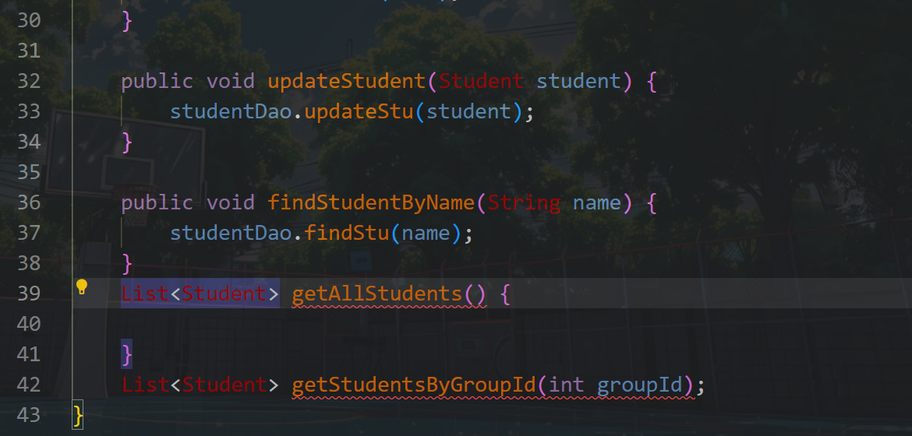

```
记录1
// 建议：防御性拷贝，防止外部修改传入的list影响内部状态
        // this.groupIds = groupIds; 
        this.groupIds = new ArrayList<>(groupIds); // 或者 Collections.unmodifiableList(new ArrayList<>(groupIds)) 如果不希望内部修改
```
```
Jackson 库的使用
```
```
搞明白为啥要先定义接口然后再去实现类呢
```
```
创建 Service 实现类 ：在实现类中注入 DAO 依赖?，并编写具体的业务逻辑
```
```
private final StudentDao studentDao; // 声明DAO接口类型的成员变量, 推荐使用 final????????
```
 必须加public吗？

路径问题挺奇怪的，相对路径就报错，换个绝对路径就好了